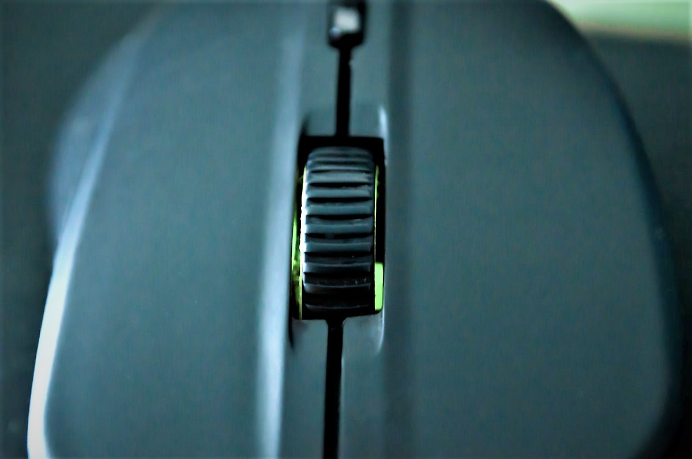
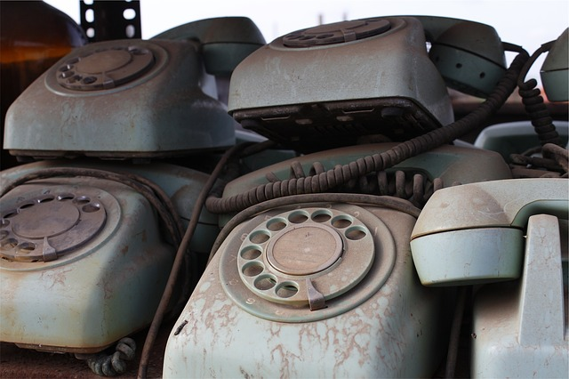

# Appendix 2. How to introduce gesture function to your application

## Introduction

`CreviceLib` is a library which provides basic gesture functions, based on the codes abstracted from core logic of **CreviceApp** 3.x. **CreviceApp** 4.0 or later is using `CreviceLib` as a library. So if you want, you can easily introduce gesture function to your application by adding a reference to `CreviceLib` and following this guidance.

_Note: `CreviceLib` is distributed as a nuget package. Visit [NuGet Gallery \| CreviceLib](https://www.nuget.org/packages/Crevice.Core/) for more details._

## Key

`CreviceLib` treats two types of key, **KeyA** and **KeyB** which abstracted from **type A (double throw)** and **type B (single throw)** keys on the real world. For example, any key of a keyboard device is the former, and up (or down) event of wheel button of a mouse device is the later. We do not need to think about the case where we need another type of key, for the peace of mind.


<div class="img-caption">Fig. Type A (double throw) key</div>


<div class="img-caption">Fig. Type B (single throw) key</div>


<div class="img-caption">Fig. An bizarre, blasphemous key</div>

**KeyA** which occupies most of use cases, have two events, `PressEvent` and `ReleaseEvent`. 

```wavedrom
{ 
    signal: [
        { name: 'KeyA', wave: '0h.l',  node: '.a.b'},
        { name: 'PressEvent', wave: '0l..',  node: '.c..' },
        { name: 'ReleaseEvent', wave: '0..l',  node: '...d' },
    ],
    edge: [
        "a->b Pressing",
        "a=c",
        "b=d",
    ]
}
```

And **KeyB** is used only in a few cases, have an only event, `FireEvent`. 

```wavedrom
{ 
    signal: [
        { name: 'KeyB', wave: '0l',  node: '.a'},
        { name: 'FireEvent', wave: '0l',  node: '.b' },
    ],
    edge: [
        "a=b",
    ]
}
```

### The difference between KeyA and KeyB

It may be seemed strange that an event be treated as a key, but a counterpart of up event of wheel button is not any of the other events which belongs to it. The counterpart of the up event is itself; you can think that it to be compressed. If there is no need to distinguish `PressEvent` and `ReleaseEvent` of a **KeyA**, do not you think that it can be compressed into a **KeyB**?

```wavedrom
{ 
    signal: [
        { name: 'KeyA', wave: '0h.l',  node: '.a.b'},
        { name: 'PressEvent', wave: '0l..',  node: '.c..' },
        { name: 'ReleaseEvent', wave: '0..l',  node: '...d' },
        {},
        { name: 'KeyB', wave: '0l..',  node: '.e'},
        { name: 'FireEvent', wave: '0l..',  node: '.f' },
    ],
    edge: [
        "b->e Compress",
        "d->f Compress",
    ]
}
```

## KeySet

`CreviceLib` provides **KeySet** classes managing a set of sequential keys. `SimpleKeySetA` corresponds to `DoubleThrowKey` and `SimpleKeySetB` corresponds to `SingleThrowKey`.


## GestureMachineConfig

## RootElement

## ContextManager

## CallbackManager

## GestureMachine

---

 three types of events.


`SimpleKeySetA`
`SimpleKeySetB`
`SimpleGestureMachineConfig`
`SimpleRootElement`
`SimpleContextManager`
`SimpleCallbackManager`
`SimpleGestureMachine`

#### Physical and Logical 
## 
