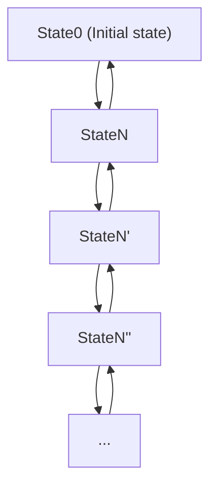
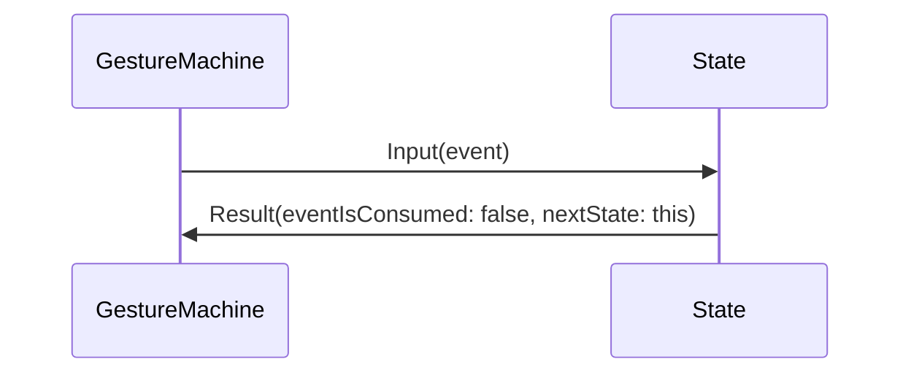
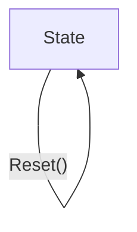

  
# Appendix 2. How to introduce gesture function to your application
  
  
## Introduction
  
  
`CreviceLib` is a library which provides basic gesture functions, based on the codes abstracted from core logic of **CreviceApp** 3.x. **CreviceApp** 4.0 or later is using `CreviceLib` as a library. So if you want, you can easily introduce gesture function to your application by adding a reference to `CreviceLib` and following this guidance.
  
_Note: `CreviceLib` is distributed as a nuget package. Visit [NuGet Gallery \| CreviceLib](https://www.nuget.org/packages/Crevice.Core/ ) for more details._
  
  
## Quickstart
  
  
At first, check if the reference to `CreviceLib` is certainly added to your project.
  
A bit simplified, but sufficiently practical classes are provided in `Crevice.Core.Example`. The very simple setup code is the following:
  
```cs
using Crevice.Core.Example;
  
var keysA = new SimpleKeySetA(maxSize: 10);
var root = new SimpleRootElement();
var gm = new SimpleGestureMachine();
```
  
Then, you can be able to start writing gesture DSL.
  
```cs
var whenever = root.When(ctx => {
    return true;
});
var action = whenever.On(keysA[0]);
action.Do(ctx => {
    // When PressEvent and ReleaseEvent of keysA[0] are given to GestureMachine,
    // then this code will be executed.
});
```
  
After writing the gesture DSL, you can now run `GestureMachine`.
  
```cs
gm.Run(root);
```
  
And finally, you should connect user input to `GestureMachine`.
  
```cs
// If the following events are input to `GestureMachine`,
gm.Input(keysA[0].PressEvent);
gm.Input(keysA[0].ReleaseEvent);
// then the action will be executed here.
```
  
After using it, `GestureMachine` should be disposed.
  
```cs
gm.Dispose();
```
  
## Key
  
  
`CreviceLib` treats two types of key, **KeyA** and **KeyB**, which abstracted from **type A (double throw)** and **type B (single throw)** keys on the real world. For example, any key of a keyboard device is the former, and up (or down) event of wheel button of a mouse device is the later. We do not need to think about the case where we need another type of key, for the peace of mind.
  

<div class="img-caption">Fig1. Type A (double throw) key.</div>
  

<div class="img-caption">Fig2. Type B (single throw) key.</div>
  

<div class="img-caption">Fig3. A bizarre, unspeakable key.</div>
  
**KeyA** which occupies most of use cases, have two events, `PressEvent` and `ReleaseEvent`. 
  
```wavedrom
{ 
    signal: [
        { name: 'KeyA', wave: '0h.l',  node: '.a.b'},
        { name: 'PressEvent', wave: '0l..',  node: '.c..' },
        { name: 'ReleaseEvent', wave: '0..l',  node: '...d' },
    ],
    edge: [
        "a->b Pressing",
        "a=c",
        "b=d",
    ]
}
```
<div class="img-caption">Fig4. KeyA.</div>
  
**KeyB** is used only in a few cases, have an only event, `FireEvent`. 
  
```wavedrom
{ 
    signal: [
        { name: 'KeyB', wave: '0l',  node: '.a'},
        { name: 'FireEvent', wave: '0l',  node: '.b' },
    ],
    edge: [
        "a=b",
    ]
}
```
<div class="img-caption">Fig5. KeyB.</div>
  
### The difference between KeyA and KeyB
  
  
It may be seemed strange that an event be treated as a key, but a counterpart of up event of wheel button is not any of the other events which belongs to it. The counterpart of the up event is itself; you can think that it to be compressed. If there is no need to distinguish `PressEvent` and `ReleaseEvent` of a **KeyA**, do not you think that it can be compressed into a **KeyB**?
  
```wavedrom
{ 
    signal: [
        { name: 'KeyA', wave: '0h.l',  node: '.a.b'},
        { name: 'PressEvent', wave: '0l..',  node: '.c..' },
        { name: 'ReleaseEvent', wave: '0..l',  node: '...d' },
        {},
        { name: 'KeyB', wave: '0l..',  node: '.e'},
        { name: 'FireEvent', wave: '0l..',  node: '.f' },
    ],
    edge: [
        "b->e Compress",
        "d->f Compress",
    ]
}
```
<div class="img-caption">Fig6. Image of the compression KeyA to KeyB.</div>
  
## KeySet
  
  
`CreviceLib` provides **KeySet** classes, which inherit `Crevice.Core.Keys.KeySet<KeyType>`, managing a set of sequential keys of **KeyA** (`DoubleThrowKey`) or **KeyB** (`SingleThrowKey`). 
  
`SimpleKeySetA` corresponds to **KeyA**, and `SimpleKeySetB` corresponds to **KeyB**. These can be used in a simply way, only take an argument `maxSize` which means the maximum size of the sequential key set.
  
```cs
var keysA = new SimpleKeySetA(maxSize: 10);
Assert.AreEqual(keysA is PhysicalDoubleThrowKeySet, true);
Assert.AreEqual(keysA[0] is PhysicalDoubleThrowKey, true);
Assert.AreEqual(keysA[0].PressEvent is PressEvent, true);
Assert.AreEqual(keysA[0].ReleaseEvent is ReleaseEvent, true);
```
  
```cs
var keysB = new SimpleKeySetB(maxSize: 10);
Assert.AreEqual(keysB is PhysicalSingleThrowKeySet, true);
Assert.AreEqual(keysB[0] is PhysicalSingleThrowKey, true);
Assert.AreEqual(keysB[0].FireEvent is FireEvent, true);
```
  
_Note: Regarding the adjective **Physical** commonly held by both names of the type of `SimpleKeySetA` and `SimpleKeySetB`, see [Physical and logical event types](#physical-and-logical-event-types ) for more details._
  
## GestureMachineConfig
  
  
`Crevice.Core.FSM.GestureMachineConfig` holds configuration values for `GestureMachine`. The configuration values are so mutable that you can edit it any time. Also you can use newly customized `GestureMachineConfig` by inheriting it.
  
`SimpleGestureMachineConfig` is a example class which inherits `GestureMachineConfig`, and do not have any change from it.
  
```cs
var config = new SimpleGestureMachineConfig();
```
  
Available properties are the following:
  
```cs
// When moved distance of the cursor exceeds this value, the first stroke 
// will be established.
config.StrokeStartThreshold = 10;
  
// When moved distance of the cursor exceeds this value, and the direction is changed,
// new stroke for new direction will be established.
config.StrokeDirectionChangeThreshold = 20;
  
// When moved distance of the cursor exceeds this value, and the direction is not changed, 
// it will be extended.
config.StrokeExtensionThreshold = 10;
  
// Interval time for updating strokes.
config.WatchInterval = 10; // ms
  
// When stroke is not established and this period of time has passed, 
// the gesture will be canceled and the original click event will be reproduced.
config.GestureTimeout = 1000; // ms
```
  
_Note: If you want to use customized `GestureMachineConfig`, it should be given as the generics type parameter to classes which extend these classes: [CallbackManager](#callbackmanager ), and [GestureMachine](#gesturemachine )._
  
## EvaluationContext
  
  
`Crevice.Core.Context.EvaluationContext` is a class to be passed to a function which declared with `When()` on gesture DSL, as the argument. By default, it is empty and does not have any value. You can inherits and extends this class so that values you need will be given to `Evaluator` on it's evaluation.
  
```cs
public class OriginalEvaluationContext : EvaluationContext
{
    public readonly DateTime Created;
  
    public EvaluationContext()
    {
        Created = System.DateTime.Now;
    }
}
```
  
_Note: If you want to use customized `EvaluationContext`, it should be given as the generics type parameter to classes which extend these classes: [RootElement](#rootelement ), [ContextManager](#contextmanager ), [CallbackManager](#callbackmanager ), and [GestureMachine](#gesturemachine )._
  
## ExecutionContext
  
  
`Crevice.Core.Context.ExecutionContext` is a class to be passed to a function which declared with `Press()`, `Do()`, and `Release()` on gesture DSL, as the argument. By default, it is empty and does not have any value. You can inherits and extends this class so that values you need will be given to `Executor` on it's evaluation.
  
```cs
public class OriginalExecutionContext : ExecutionContext
{
    public readonly DateTime Created;
    public readonly OriginalEvaluationContext EvaluationContext;
  
    public EvaluationContext(OriginalEvaluationContext evaluationContext)
    {
        Created = System.DateTime.Now;
        EvaluationContext = evaluationContext;
    }
}
```
  
_Note: If you want to use customized `ExecutionContext`, it should be given as the generics type parameter to classes which extend these classes: [RootElement](#rootelement ), [ContextManager](#contextmanager ), [CallbackManager](#callbackmanager ), and [GestureMachine](#gesturemachine )._
  
## RootElement
  
  
`Crevice.Core.DSL.RootElement<EvaluationContext, ExecutionContext>` is the root element of the tree of gesture DSL. You can start definiting of your gestures with `When()` function. See [Gesture DSL](#gesture-dsl ) for more details about it.
  
`SimpleRootElement` is a class which is simplified about it's generics types, and is able to be created without generics parameters.
  
```cs
var root = new SimpleRootElement();
var whenever = root.When(ctx => {
    return true;
});
whenever
.On(keysA[0]) 
.Do(ctx => {
    // When PressEvent and ReleaseEvent of keysA[0] are given to GestureMachine,
    // then this code will be executed.
});
```
  
## ContextManager
  
  
`Crevice.Core.Context.ContextManager<EvaluationContext, ExecutionContext>` manages `ctx` in the functions like `When()`, or `Do()` on gesture DSL. If you want to initialize `EvaluationContext` or `ExecutionContext` in your own way, you can do it with inheriting and extending this class.
  
```cs
public class OriginalContextManager : ContextManager<OriginalEvaluationContext, OriginalExecutionContext>
{
    public override OriginalEvaluationContext CreateEvaluateContext()
        => // Initialization code for `OriginalEvaluationContext`.
  
    public override OriginalExecutionContext CreateExecutionContext(OriginalEvaluationContext evaluationContext)
        => // Initialization code for `OriginalExecutionContext`.
}
```
  
`SimpleContextManager` is a class which is simplified about it's generics types, is able to be created without generics parameters, and is overrided the default initializer for `EvaluationContext` and `ExecutionContext`. 
  
```cs
var contextManager = new SimpleContextManager();
```
  
_Note1: You should override `CreateEvaluateContext()` and `CreateExecutionContext()` if you create a class inherits ContextManager, or else these functions throw an `NotImplementedException`._
  
_Note2: If you want to use customized `ContextManager`, it should be given as the generics type parameter to classes which extend these classes: [CallbackManager](#callbackmanager ), and [GestureMachine](#gesturemachine )._
  
## CallbackManager
  
  
`Crevice.Core.Callback.CallbackManager<GestureMachineConfig, ContextManager, EvaluationContext, ExecutionContext>` manages callbacks of `GestureMachine`. 
  
`SimpleCallbackManager` is a class which is simplified about it's generics types, and is able to be created without generics parameters.
  
  
```cs
var callbackManager = new SimpleCallbackManager();
```
  
Avaliable event properties are the following:
  
```cs
callbackManager.StrokeReset += (sender, e) => { };
callbackManager.StrokeUpdate += (sender, e) => { };
callbackManager.StateChange += (sender, e) => { };
callbackManager.GestureCancel += (sender, e) => { };
callbackManager.GestureTimeout += (sender, e) => { };
callbackManager.MachineStart += (sender, e) => { };
callbackManager.MachineReset += (sender, e) => { };
callbackManager.MachineStop += (sender, e) => { };
```
  
See [Config - Events](#events ) for the details.
  
## GestureMachine
  
  
`Crevice.Core.FSM.GestureMachine<GestureMachineConfig, ContextManager, EvaluationContext, ExecutionContext>` is the main component of `CreviceLib`. 
  
`SimpleGestureMachine` is a class which is simplified about it's generics types, and is able to be created without generics parameters.
  
```cs
var keysA = new SimpleKeySetA(maxSize: 10);
var root = new SimpleRootElement();
var gm = new SimpleGestureMachine();
gm.Run(root);
gm.Input(keysA[0].PressEvent);
gm.Input(keysA[0].ReleaseEvent);
// ...snip...
gm.Dispose();
```
  
_Note: This class is `IDisposable` so it should be disposed by calling `Dispose()` after using it._
  
## Physical and logical event types
  
  
`CreviceLib` supports physical and logical event types, for the abstraction of multiple input devices. In contrast to `Input()` function of `GestureMachine` which only takes physical event, `On()` function in gesture DSL takes both physical and logical events. In case a logical event be given to `On()` as the arguement, and a physical event corresponding to it be given to `Input()`, `GestureMachine` will treat it correctly in their relationship on physical and logical event types.
  
## FSM of GestureMachine
  
  
`GestureMachine` has a state representing it's current context. The initial state is the instance of `State0`, and the others are of `StateN`. `N` of `StateN` means an natural number grater than 0. So, there is no limit for the depth of the context.
  

  
  
_Note: Crevice 3.x has the limit for the depth of the context. This limitation has been relaxed on Crevice 4.0._
  
`CreviceLib` supports several features which naturally be in need of like the following: **cancel**, **timeout**, and  **reset**. `GestureMachine`, `State0`, and `StateN` should support this; therefore the flow of process and the implimentations of these classes are a bit complexed, but these are in reason, so the following gudance may be sutable even for those new to FSM (Finite state machine) to learn it.
  
### Result
  
  
`Crevice.Core.FSM.Result` is a class representing the result of `Input()` function which is implemented in `State`, `State0`, and `StateN`.
  
`Result` has two properties, `EventIsConsumed` and `NextState`. `EventIsConsumed` represents the event given to `Input()` was consumed or not, and `NextState` represents the next state of `GestureMachine`; this can be itself and can be `State0` directly from deeper one, for example `StateN` (N=3).
  
`Result` can be initialized as following:
  
```cs
Result.Create(eventIsConsumed: false, nextState: this);
```
  
 _Note: `GestureMachine` also has `Input()` function, but it is not same to this; it calls `Input()` of internal `State` and returns boolean value, `Result.EventIsConsumed`._
  
### State
  
  
`Crevice.Core.FSM.State` is parent abstract class for `State0` and `StateN`.
  
`State` have a only one property `Depth`,
```cs
public int Depth { get; }
```
  
a constructor,
```cs
public State(int depth)
{
    Depth = depth;
}
```
  
virtual functions,
```cs
public virtual Result Input(IPhysicalEvent evnt)
    => Result.Create(eventIsConsumed: false, nextState: this);
  
public virtual State Timeout()
    => this;
  
public virtual State Reset()
    => this;
```
  
and functions for utility, used by child classes,
```cs
protected static bool HasPressExecutors(
    IReadOnlyList<IReadOnlyDoubleThrowElement> doubleThrowElements)
    => doubleThrowElements.Any(d => d.PressExecutors.Any());
  
protected static bool HasDoExecutors(
    IReadOnlyList<IReadOnlyDoubleThrowElement> doubleThrowElements)
    => doubleThrowElements.Any(d => d.DoExecutors.Any());
  
protected static bool HasReleaseExecutors(
    IReadOnlyList<IReadOnlyDoubleThrowElement> doubleThrowElements)
    => doubleThrowElements.Any(d => d.ReleaseExecutors.Any());
```
  
and used mainly in user script; `State` may be returned as a parameter of callback events. The following functions are useful for treating convertion of `State` to it's child class. It is hard to do it without these, because `State`, `State0`, and `StateN` are heavily parameterlized by generics types.
  
```cs
public bool IsState0 => GetType() == typeof(State0<...snip...>);
public bool IsStateN => GetType() == typeof(StateN<...snip...>);
  
public State0<...snip...> AsState0()
    => this as State0<...snip...>;
  
public StateN<...snip...> AsStateN()
    => this as StateN<...snip...>;
```
  
Here, `State` is already supports basic functions, `Input()`, `Timeout()`, and `Reset()`.
  
`Input()` of `State` always returns `Result(eventIsConsumed: false, nextState: this)`. This means the event given to this will never be consumed.
  

  
`Timeout()` and `Reset()` of `State` always returns itself. This means if the state of a `GestureMachine` is `State`, it will not be effected by these functions.
  

  
_Note: Generics type patameters are abbreviated on the avobe codes for readability. If you want to read the original code, see [Core.FSM.State.cs](https://github.com/creviceapp/creviceapp/blob/9a090645bb5255680e50331fb3f1f9cdfcdb7e63/CreviceLib/Core.FSM.State.cs )._
  
### State0
  
  
`Crevice.Core.FSM.State0` is the initial state. This class inherits `State`.
  
  
### StateN
  
  
`Crevice.Core.FSM.StateN` represents states in which the depth grater than 0. This class inherits `State`.
  