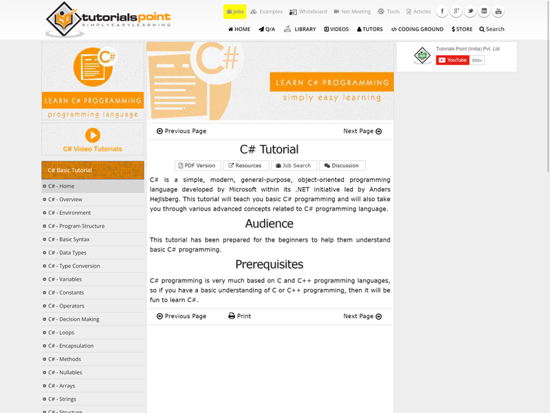
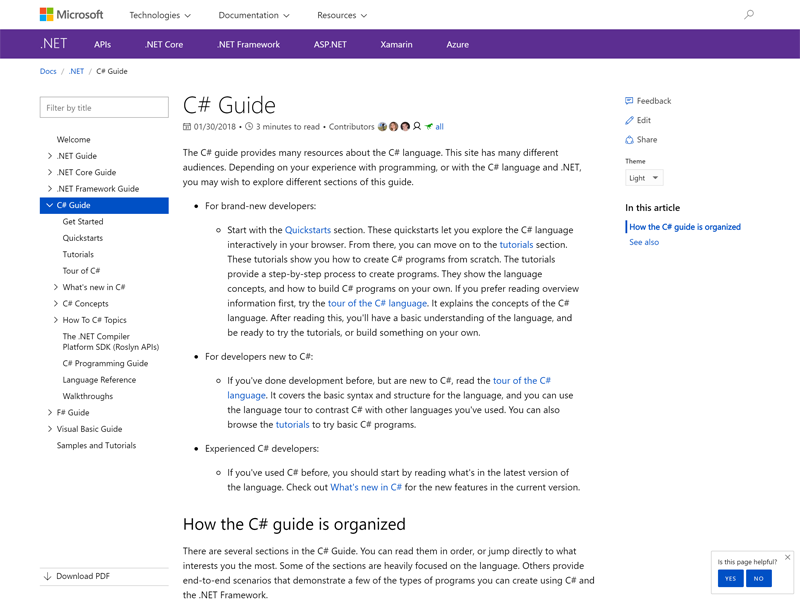

  
# Overview of C# Scripting
  
  
C# Scripting is a powerful and flexible scripting feature provided by [Microsoft Roslyn](https://github.com/dotnet/roslyn ). It designed to make scripts you cut and pasted from C# code work as-is. So, you can build your own gesture environment easily just only with a little of knowledge of C# language. But C# Scripting has only a few special feature C# language does not have. The following sections are the introduction of the features very useful if you know it when you need to do it.
  
## #r directive
  
  
You can add reference to assemblies by `#r` directive. 
  
```cs
// Add a reference to dll file.
#r "path_to/Assembly.dll"
  
// Add a reference to an assembly.
#r "System.Speech"
  
// Error occurrs unless you have installed Visual Studio.
#r "Microsoft.VisualStudio" 
```
  
_Note 1: This directive should be placed on the top of your C# Scripting code._
_Note 2: This directive does not support to load NuGet package automatically. You can do it by download NuGet package by yourself, extract dll files, and add refereces to it by using `#r` directive._
  
## #load directive
  
  
You can load the content in another C# Scripting file by `#load` directive.
  
```cs
#load "path_to/another.csx"
```
  
_Note : This directive should be placed on the top of your C# Scripting code except for `#r` directive._
  
  
## Tutorial of C# Language
  
  
There are a lot of good tutorials of C# language that you can pick to learn. The followings are just an example:
  
<a href="https://docs.microsoft.com/en-us/dotnet/csharp/quick-starts/"></a>
<div class="img-caption"><a href="https://docs.microsoft.com/en-us/dotnet/csharp/quick-starts/">C# interactive tutorials - C# quickstarts | Microsoft Docs</a></div>
  
<a class="img-caption" href="http://www.learncs.org/"></a>
<div class="img-caption"><a href="http://www.learncs.org/">Learn C#</a></div>
  
<a class="img-caption" href="https://www.sololearn.com/Course/CSharp/"></a>
<div class="img-caption"><a href="https://www.sololearn.com/Course/CSharp/">C# Tutorial | SoloLearn</a></div>
  
<a class="img-caption" href="https://www.tutorialspoint.com/csharp/index.htm"></a>
<div class="img-caption"><a href="https://www.tutorialspoint.com/csharp/index.htm">C# Tutorial | TutorialsPoint</a></div>
  
<a class="img-caption" href="https://mva.microsoft.com/en-US/training-courses/c-fundamentals-for-absolute-beginners-16169?l=Lvld4EQIC_2706218949"></a>
<div class="img-caption"><a href="https://mva.microsoft.com/en-US/training-courses/c-fundamentals-for-absolute-beginners-16169?l=Lvld4EQIC_2706218949">Learn C# for Beginners | Microsoft Virtual Academy</a></div>
  
<a class="img-caption" href="https://docs.microsoft.com/en-us/dotnet/csharp/"></a>
<div class="img-caption"><a href="https://docs.microsoft.com/en-us/dotnet/csharp/">C# Guide | Microsoft Docs</a></div>
  